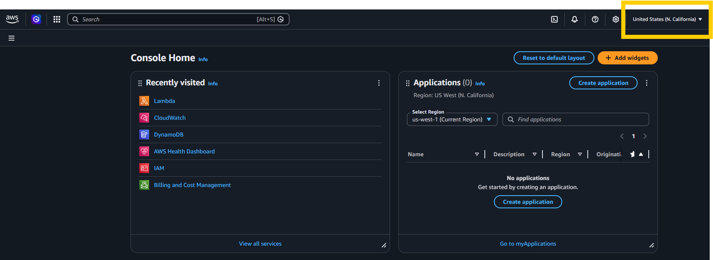
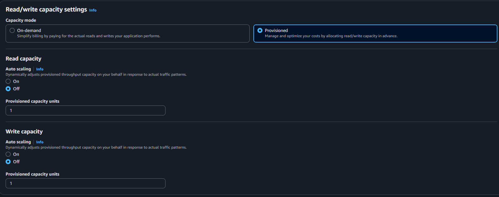
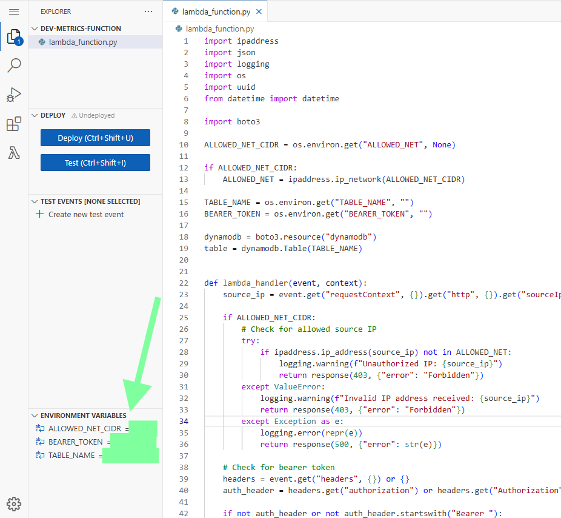
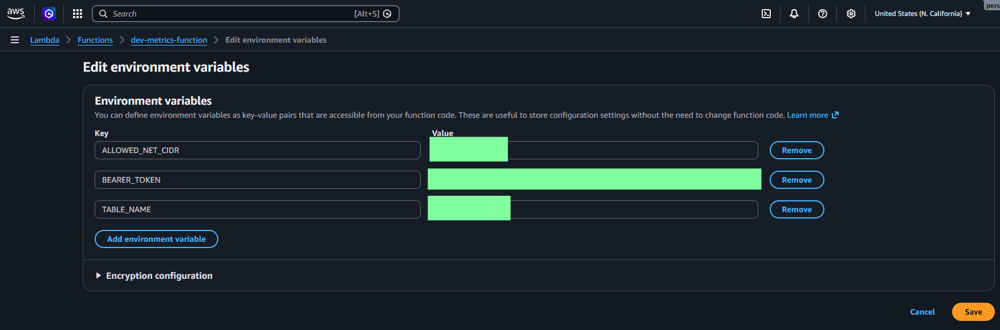
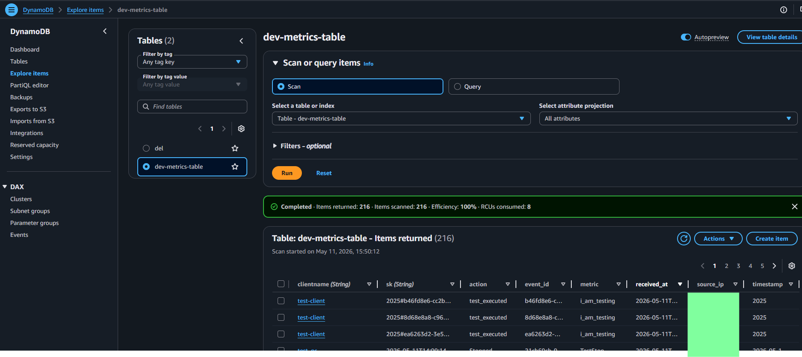
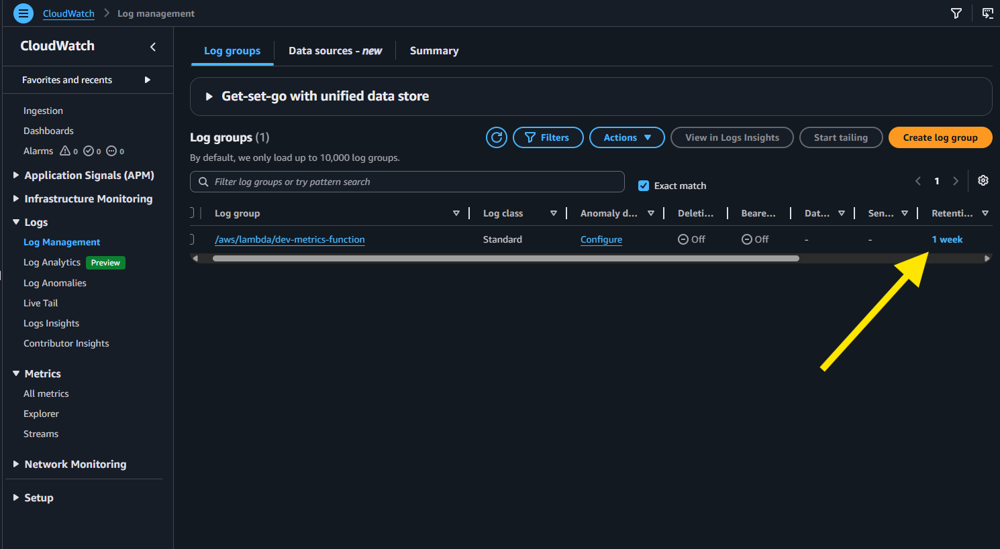

# AV-System-Metrics: AWS Serverless

AWS Serverless system using Lambda and DynamoDB for AV system metric ingestion.

- Client: Any control system that can send REST web requests
- Server: Amazon Web Services Serverless (Lambda, DynamoDB)

## Costs

This system may be covered partially or entirely by the AWS "Always Free" tier for most organizations! Make sure to monitor, setup budgets, alerts, handle logging, and consult with your rep or admin to be sure for your use case.

## How To

This guide presumes you already have an AWS admin account setup with the appropriate permissions.

### Create the Database

- Make sure your AWS admin console is in the region you want to use

- DynamoDB -> Tables -> Create Table:
  - Partition key: `clientname` : string
  - Sort key: `sk` : string
  - Table Settings: Customize Settings
  
  *Note: The simplest serverless option is to keep the default On-demand capacity mode, because DynamoDB scales request capacity for you. To keep cost as predictable and low as possible, you can use the 1 RCU / 1 WCU Provisioned Capacity settings below, but read the capacity note before choosing this for production.*
  - Read/write capacity settings
    - Provisioned
    - Read and Write Auto Scaling to Off
    - Read and Write Provisioned capacity units to 1



### Provisioned Capacity and Data Loss Risk

With the suggested 1 RCU / 1 WCU provisioned settings, this system can ingest roughly one sub-1 KB metric write per second across all clients. Exceeding this limit does not make DynamoDB silently lose data, but it can throttle writes or return unprocessed batch items, which the Lambda and included clients retry. Data can be lost if the retry backlog outlives a client's in-memory queue, (250 messages by default), if the client restarts or loses power before flushing, or if a permanent HTTP `4xx` configuration/payload error causes the client to drop the batch instead of retrying. If losing metrics is unacceptable, use On-demand capacity, enable DynamoDB Auto Scaling, or provision enough WCU for the total expected write rate. Relevant AWS docs: [capacity modes](https://docs.aws.amazon.com/amazondynamodb/latest/developerguide/capacity-mode.html), [provisioned capacity](https://docs.aws.amazon.com/amazondynamodb/latest/developerguide/provisioned-capacity-mode.html), [error handling](https://docs.aws.amazon.com/amazondynamodb/latest/developerguide/Programming.Errors.html), and [burst/adaptive capacity](https://docs.aws.amazon.com/amazondynamodb/latest/developerguide/burst-adaptive-capacity.html).

### Create the Lambda Function

Lambda -> Functions -> Create Function:

- Author from scratch
- Runtime: Python (latest supported version)
- Additional Settings
  - Check `ARM64 architecture`
  - Check `Function URL` unless you plan to use the optional API Gateway setup below
    - Set Auth type to `NONE` (the function handles bearer-token authentication)

Leave the rest of the values at default

### Create environmental variables




`ALLOWED_NET`: Optional CIDR network notation of what client IPs are allowed to communicate with the function. It is recommended you set this to only the public IP(s) of your network. Example: 132.241.50.0/24 (covers 132.241.50.0 - 132.241.50.255). If you're using NAT and only have one public IP that all your devices communicate from, use `your_address/32`. If no address is specified any IP can call the function, but they'll still need the bearer token to perform any actions.

`BEARER_TOKEN`: Generate your own random alphanumeric string. Keep this a secret. This is your client authentication and is required before the function will write anything to the database.

The Lambda refuses to initialize if `BEARER_TOKEN` is left as the example value `change-me-long-random-token`.

`TABLE_NAME`: The name of the database table you made earlier.

### Copy the code

Copy `AWS_Serverless/lambda_function.py` into your Lambda code editor and click deploy.

### Grant Database Write Access to the Lambda Function

- Lambda → your-function → Configuration → Permissions → Execution role
- Click on the role name (my-function-role-abc123)
- Click `Add permissions` -> `Create inline policy`
- Open the JSON editor and paste the below JSON, replacing the `variables` as needed, then save the policy.

Replace:

- `REGION` → e.g. us-west-1
- `ACCOUNT_ID` → your AWS account ID (find in the very top right of the webpage)
- `TABLE_NAME` → your DynamoDB table name

```json
{
  "Version": "2012-10-17",
  "Statement": [
    {
      "Effect": "Allow",
      "Action": [
        "dynamodb:PutItem",
        "dynamodb:BatchWriteItem"
      ],
      "Resource": "arn:aws:dynamodb:<REGION>:<ACCOUNT_ID>:table/<TABLE_NAME>"
    }
  ]
}

```

### Optional: Put API Gateway in Front of Lambda

A Lambda Function URL is the simplest and lowest-cost endpoint. Use an API Gateway HTTP API instead if you need features such as a custom domain, request throttling, or more detailed API monitoring. API Gateway has its own pricing, logging, and quotas, so include it in your AWS cost monitoring. See AWS's [guidance for choosing between Function URLs and API Gateway](https://docs.aws.amazon.com/lambda/latest/dg/furls-http-invoke-decision.html).

This option replaces the Function URL; you do not need both. If you already created a Function URL and want API Gateway to be the only public endpoint, remove the Function URL from Lambda after the Gateway endpoint is working.

1. Open **API Gateway** in the same AWS region as the Lambda function.
2. Select **Create API**, then select **Build** under **HTTP API**. Do not choose REST API: this Lambda expects the HTTP API payload format described below.
3. Add a Lambda integration and select the Lambda function created above.
4. Name the API, then configure this route:
   - Method: `POST`
   - Resource path: `/metrics`
   - Integration target: your Lambda function
   - Authorization: `NONE` (the Lambda still validates the bearer token)
5. Create a `$default` stage with automatic deployment enabled, then create the API.
6. Open the API's integration details and confirm that **Payload format version** is `2.0`. The included Lambda reads the HTTP method and source IP from the version 2.0 request context. For details, see AWS's [HTTP API Lambda proxy integration documentation](https://docs.aws.amazon.com/apigateway/latest/developerguide/http-api-develop-integrations-lambda.html).
7. Copy the stage's **Invoke URL** and append `/metrics`. The resulting ingest URI will look like:

   ```text
   https://<api-id>.execute-api.<region>.amazonaws.com/metrics
   ```

The API Gateway console normally adds permission for the API to invoke the Lambda function when you create the integration. If requests return an invocation-permission error, check **Lambda -> your-function -> Configuration -> Permissions -> Resource-based policy** for an `apigateway.amazonaws.com` entry.

Set the client's URI to the full API Gateway `/metrics` invoke URI. The clients use the same request format for Lambda Function URLs, API Gateway, and self-hosted endpoints.

### Do a quick test in Powershell

Give it a minute or two for resources to deploy and permissions to update, then, from a workstation within the allowed IP range (if specified):

```pwsh
Invoke-RestMethod -Method POST -Uri "<your_ingest_uri>" `
>>   -ContentType "application/json" `
>>   -Headers @{Authorization = 'Bearer <your bearer token>'} `
>>   -Body '{
>>     "clientname": "test-client",
>>     "timestamp": "2026-05-12T10:27:35.442913+00:00",
>>     "metric": "i_am_testing",
>>     "action": "test_executed"
>>   }'
```

If configured correctly, you should see:

```pwsh
  ok count
  -- -----
True     1
```

For a Function URL, `<your_ingest_uri>` is the Function URL. For API Gateway, it is the full invoke URI ending in `/metrics`.

### Check your table for the test entry

DynamoDB -> Tables -> `your table` > Explore Items



### Recommended: Set Log Rotation

The Lambda function is coded to only log warnings and errors, but simply invoking the function creates four log entries from Amazon by default. In order to be safe, it is recommended to set a log rotation schedule if your internal policies allow.

CloudWatch -> Log Management


## Client Implementation

See the readme for your system in [Clients folder](/Clients/)

## Troubleshooting

If your test is getting errors, find the actual cause in the live logs:
CloudWatch -> Logs -> Live Tail -> Select your function in the filter dropdown -> Apply filters

Then you can send additional requests and see the errors as they come in.

## Notes

### Time

All timestamps are in UTC and this is intentional
